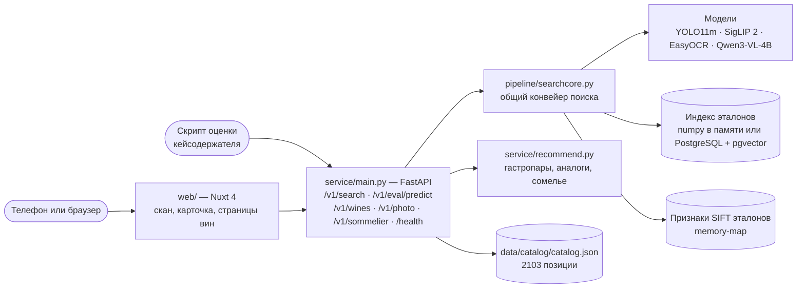
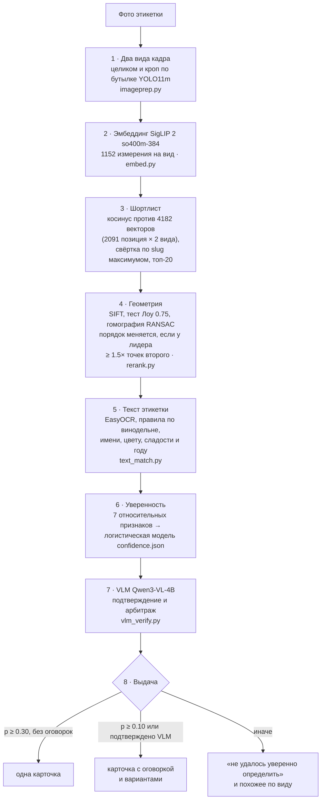
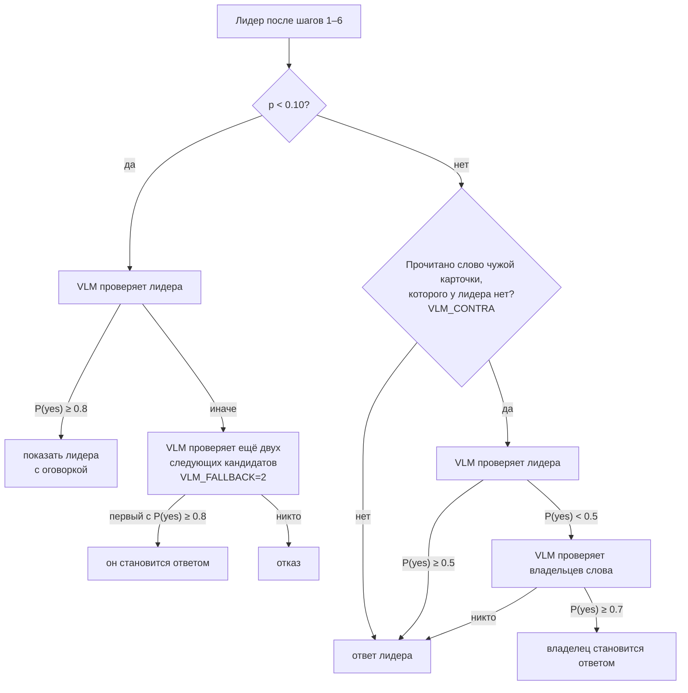
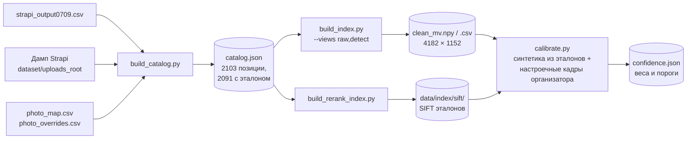
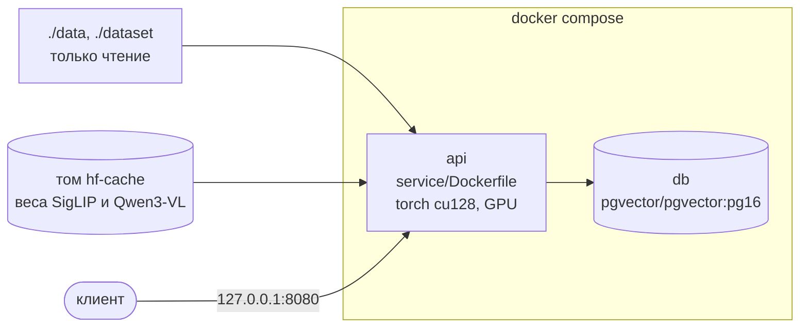

# Архитектура

Сервис отвечает на один вопрос: какая позиция каталога «Своё Вино» изображена
на фотографии этикетки. Он возвращает одну карточку, карточку с оговоркой
и вариантами или честный отказ, «не удалось уверенно определить». Числа
качества — в [README](README.md), методика замеров — в
[docs/metrics.md](docs/metrics.md).

## Общая схема

Один и тот же модуль `pipeline/searchcore.py` вызывают сервис, калибровка
и все замеры. Поэтому пороги подбираются ровно для того конвейера, который
отвечает пользователю.

## Конвейер запроса

### 1. Два вида кадра

`pipeline/imageprep.py`: YOLO11m находит бутылки, выбирается целевая,
крупная и ближе к центру. Дальше идут оба вида: кроп по бутылке и кадр
целиком. Если детектор взял не ту бутылку, второй вид всё равно даёт
шанс найти вино.

### 2–3. Отбор кандидатов

SigLIP 2 so400m-384 (`pipeline/embed.py`) переводит каждый вид в вектор
на 1152 измерения. Каждая позиция каталога описана так же, двумя векторами
по её эталонному фото. Косинус считается против всех 4182 векторов индекса,
по каждой позиции берётся лучший, и выдача сворачивается по slug. В
шортлист идут 20 позиций. Индекс хранится в памяти (numpy) или в
PostgreSQL с pgvector (`VECTOR_BACKEND=pgvector`). База делает точный поиск,
косинус пересчитывается по тем же float32-векторам, поэтому шортлисты
в обоих вариантах совпадают.

### 4. Геометрическая проверка

Эмбеддинг отвечает на вопрос «похожая ли этикетка» и путает позиции одной
линейки. Их отличает мелкий шрифт. Геометрия отвечает на другой вопрос —
«та же самая этикетка» (`pipeline/rerank.py`):

- точки SIFT на кадре приводятся к 700 px по длинной стороне, берётся до
  1200 точек;
- соответствия с эталоном проходят тест Лоу 0.75;
- гомография RANSAC с допуском 5 px оставляет инлаеры, то есть точки,
  которые легли на одно преобразование.

Признаки всех эталонов посчитаны заранее и открываются через memory-map.
Для геометрии берётся тот вид кадра, который лучше узнал каталог.

Порядок по точкам заменяет косинусный, только если у лидера по точкам
совпавших точек не меньше чем в 1.5 раза больше, чем у второго
(`GEOMETRY_MARGIN=0.50`). Иначе геометрия считается нерешающей, и порядок
остаётся по косинусу: у линеек с общей этикеткой разница в точках —
шум, а не свидетельство.

### 5. Текст этикетки

EasyOCR один раз читает кроп (`pipeline/ocr.py`). Прочитанные строки
проходят через правила `pipeline/text_match.py` и шаг `searchcore.settle`:

- **винодельня.** Уверенно прочитанное имя винодельни, принадлежащее одной
  из виноделен шортлиста, выводит её вина вперёд;
- **разрешение близких.** Если геометрия не развела лидеров (у соседа не
  меньше 80% точек лидера), кандидаты сравниваются словами. В группу
  добавляются и владельцы уверенно прочитанного имени вина. Кандидат,
  у которого прочитанного различающего слова нет, опускается;
- **противоречие лидеру.** Прочитанные цвет, сладость или год, которые
  противоречат карточке лидера, отправляют его вниз;
- **проверка лидера.** Улики против лидера и подтверждения за него идут
  в признаки уверенности.

Сравнение слов учитывает смешение кириллицы и латиницы («KPACHOЕ») и
транслитерацию имён. Нечёткое совпадение допускается только при
уверенном чтении.

### 6. Уверенность

`searchcore.features` считает семь относительных признаков лидера:

- доля его точек в паре с прямым соперником;
- логарифм числа точек;
- отрыв по косинусу от соперника;
- превышение над хвостом шортлиста;
- покрытие этикетки совпавшими точками;
- поддержка текстом;
- улики против лидера.

Признаки относительные, потому что абсолютные шкалы на снимке с полки
другие, чем на эталоне. Логистическая модель (`data/index/confidence.json`,
`pipeline/calibrate.py`) выдаёт две вероятности:
- P(лидер верен);
- P(верный ответ в пятёрке).

Модель обучена на синтетике из эталонов дампа и на настроечной части
снимков организатора.

### 7. VLM: подтверждение и арбитраж

Qwen3-VL-4B-Instruct (`pipeline/vlm_verify.py`) получает кадр, до трёх
эталонов кандидата и поля его карточки. Ответ — P(yes) на вопрос «тот ли
это товар», по логитам «yes/no». VLM не переставляет пятёрку сама, она
вызывается в трёх ситуациях:

Слово «чужой карточки» — уверенно прочитанное (≥ 0.85) слово от пяти букв,
близкое к слову названия, сорта или винодельни другого кандидата по
расстоянию Дамерау–Левенштейна (до 20% длины). Примеры — «ЦИТРОН», «АЛУШТА».

### 8. Выдача

`/v1/search` возвращает состояние, карточку, варианты, обе вероятности,
данные VLM и тайминги по ступеням. Состояния:

| состояние | условие | что видит пользователь |
|---|---|---|
| `confident` | P ≥ 0.30, против лидера нет улик, а если рядом близкие соседи по линейке — текст подтвердил именно его | одна карточка |
| `uncertain` | P ≥ 0.10 или ответ подтвердила VLM | карточка «скорее всего» и варианты |
| `unsure` | иначе | «не удалось уверенно определить», похожее по виду |

`/v1/eval/predict` — контракт скрипта оценки: `{"slug": "..."}`. При
`EVAL_ABSTAIN=1` (по умолчанию) там, где карточка не была бы показана,
возвращается `{"slug": null}`.

`service/recommend.py` добавляет к найденному вину гастропары, похожие вина
других виноделен и подбор «Цифрового сомелье» по трём вопросам.

## Офлайн-сборка данных

Эталон позиции — только файл из дампа кейса: по рекомендации организатора
других изображений в индексе нет. Связь позиции с файлом берётся из
`data/datapack/photo_map.csv`, поэтому сборка на любой машине даёт тот же
каталог. Ручные исправления лежат в `photo_overrides.csv`. У 12 позиций
файла эталона в дампе нет, и они остаются без эталона.

## Модули

| Слой | Файлы | Роль |
|---|---|---|
| Данные | `pipeline/build_catalog.py`, `build_index.py`, `build_rerank_index.py` | каталог, векторный индекс, признаки SIFT |
| Ядро поиска | `pipeline/searchcore.py` | шаги конвейера и признаки уверенности, общие для сервиса и замеров |
| | `pipeline/imageprep.py`, `embed.py`, `rerank.py` | детекция и виды кадра, эмбеддинги, геометрия |
| | `pipeline/ocr.py`, `text_match.py`, `core/matcher.py`, `core/normalize.py` | чтение и сравнение текста |
| | `pipeline/vlm_verify.py`, `vector_store.py` | VLM-проверка, хранилище векторов |
| Сервис | `service/main.py`, `service/recommend.py` | HTTP API, решение о выдаче, рекомендации |
| Интерфейс | `web/` | Nuxt 4 SPA: скан, карточка, увеличение фото, страница вина `/wine/<slug>` |
| Замеры | `pipeline/eval_field.py`, `calibrate.py`, `api_check.py`, `organizer_summary.py`, `replay_rerank.py` | воспроизводимые метрики, калибровка, сквозная проверка через HTTP |

## Интерфейс

`web/` — Nuxt 4 без серверного рендеринга. Модуль рассчитан на встраивание
в каталог портала.

- **Страницы:** сканер с результатом (`/`) и страница вина (`/wine/<slug>`)
  с карточкой, гастропарами и похожими винами.
- **Фото:** увеличивается по касанию.
- **Навигация:** результат поиска хранится в общем состоянии, поэтому
  «Назад» возвращает к нему без повторного сканирования.
- **Адрес API:** берётся из `NUXT_PUBLIC_API_BASE`, а если он не задан —
  из адреса страницы (тот же хост, порт 8080). Так интерфейс, открытый
  с телефона по адресу компьютера в локальной сети, работает без
  пересборки.

## Развёртывание

- **Образ.** В образ входят код сервиса и веса YOLO11m и EasyOCR. Каталог,
  индексы и дамп монтируются только для чтения.
- **Веса SigLIP и Qwen3-VL** скачиваются при первом старте в том
  `hf-cache`.
- **Старт.** Сервис загружает индекс в pgvector (при изменении — по хешу),
  прогревает модели пустым кадром и только потом отвечает.
- **Видеопамять:** около 12 ГБ с VLM, около 6 ГБ без неё (`VLM_CONFIRM=0`).
  Без CUDA VLM выключается сама.
- **Интерфейс** в compose не входит и поднимается отдельно
  (`npm run dev --prefix web`).

## Ограничения

- **Позиции без эталона.** 12 из 2103 не находятся ни при каких условиях.
- **Почти-дубли.** Часть позиций одной линейки различается крепостью или
  годом, которых нет на лицевой этикетке.
- **Карточки-дубли.** 159 карточек в 72 группах с одинаковыми винодельней
  и названием, часто с эталонами разных тиражей. Какой slug ожидает
  закрытая разметка, неизвестно.
- **Слабые эталоны.** У части линеек эталоны — мелкие скриншоты или
  этикетка прошлого поколения. Геометрии на них мало точек, и решают
  косинус, текст и VLM.
- **Время ответа.** На снимке телефона 3024×4032 ответ занимает около
  1 с. В случаях, когда VLM проверяет нескольких кандидатов подряд, — до
  3.3 с. `VLM_BUDGET_MS` ограничивает дополнительные проверки временем.
